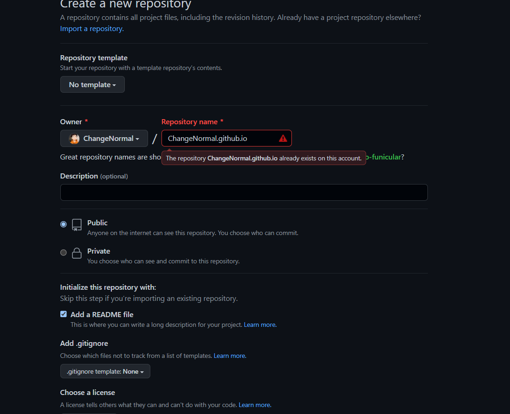
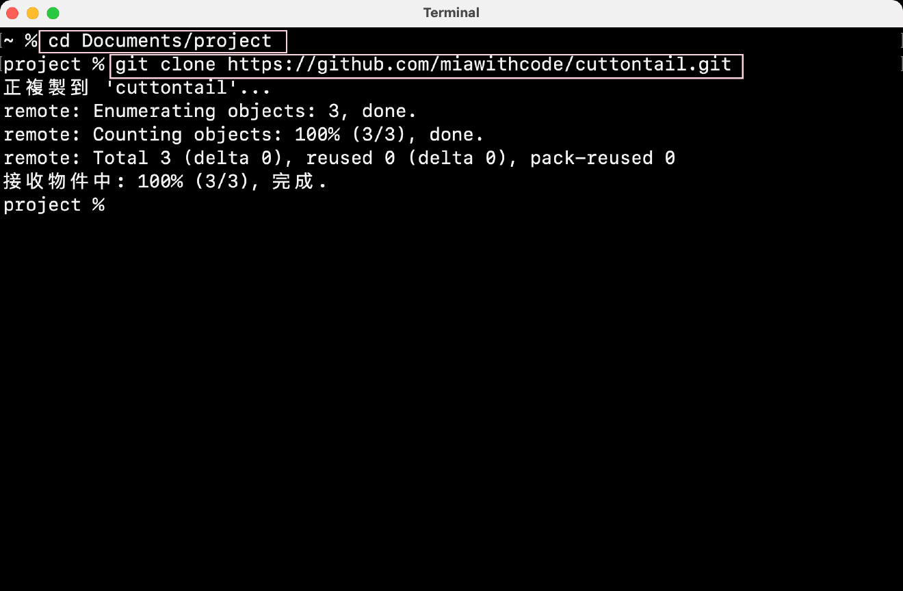

对于博客我其实在2021年就已经有过搭建，当时经同学介绍使用的是Hexo，如今我换成了Hugo，感觉用起来不错。

<!--more-->

# 学习Hugo个人博客搭建+GitHub Pages

在开始之前你需要有：Git相关的基础知识，markdown语言，Github账号  

## 一、搭建个人博客的意义

* 你可以将平时学习的技术记录到博客中防止遗忘
* 分享技术给需要的人
* 面试工作的时候作为一个加分项


## 二、准备工作

* 下载Git和Hugo的最新版本
* 下载地址请自行Google，自主查找的过程也是提升自己的重要手段
* 注册一个Github账号
* 下载VS Code代码编辑器


## 三、什么是GitHub Pages？

[GitHub Pages](https://pages.github.com/) 是一组静态网页集合(Static Web Page)，这些静态网页由 [GitHub](https://github.com/) 托管(host)和发布，所以是 GitHub + Pages。


## 四、什么是Hugo?

[Hugo](https://gohugo.io/) 是用Go语言写的静态网站生成器(Static Site Generator)。可以把Markdown文件转化成HTML文件。


## 五、网站搭建的基本思路

1. 创建2个GitHub仓库
   - 博客源仓库：储存所有的Blog文件
   - GitHub Pages仓库：将网页部署在GitHub Pages
2. 将在**博客源仓库**中Hugo生成的静态HTML文件部署到远端**GitHub Pages仓库**中。


## 六、创建GitHub仓库

### 6-1 创建博客源仓库

1. 命名博客源仓库
2. ✔勾选Public,设置为公开仓库
3. ✔勾选添加README文件


注意：仓库名称需要添加为自己的Github用户名.github.io




## 七、克隆博客源仓库到本地

1. 打开想要在本地储存项目的文件夹（🌰: 我的项目的文件夹是 `Myblog` )

   ```
   cd project
   ```

2. 克隆**博客源仓库**到项目文件夹，克隆时使用的HTTPS仓库链接在这里查看：


``` 
git clone https://github.com/miawithcode/cuttontail.git
```




## 八、使用Hugo创建网站

1. 进入刚刚克隆下来的**博客源仓库**文件夹（比如：我的博客源仓库文件夹名是 `cuttontail`，则`cd cuttontail` ），在这个文件夹里用Hugo创建一个网站文件夹。
2. 用Hugo创建网站文件夹的命令是 `hugo new site 网站名字`。(比如，我的命名是 `cuttontail-blog`)

```
cd cuttontail
hugo new site cuttontail-blog
```


3. 用Hugo创建网站共有7个文件夹和一个文件，这些文件分别代表：


- **archetypes**：存放用hugo命令新建的md文件应用的front matter模版
- **content**：存放内容页面，如Blog
- **layouts**：存放定义网站的样式，写在`layouts`文件下的样式会覆盖安装的主题中的 `layouts`文件同名的样式
- **static**：存放所有静态文件，如图片
- **data**：存放创建站点时Hugo使用的其他数据
- **public**：存放Hugo生成的静态网页
- **themes**：存放主题文件
- **config.toml**：网站配置文件


<p style="font-size:20px"> &#128512; &#128516; &#128525; &#128151;

<hr>


